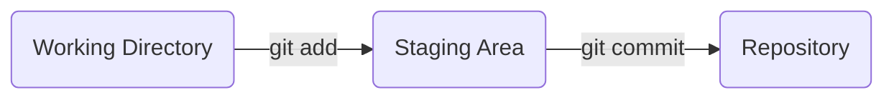

# Brief Description

This is my note for [The Git & Github Bootcamp](https://www.udemy.com/course/git-and-github-bootcamp/) course

# Course Covers

**Git Core :** **`Intro to Git`**, [**`Installation`**](#installation--setup), [**`Command Line`**](#command-line), [**`Git Basics`**](#git-basics), [**`Committing in Detail`**](#committing-in-detail), **`Branching`**, **`Merging`**

**Next Level Git :** **`Diffing`**, **`Stashing`**, **`Undoing Changes`**

**Github and Collaboration Core :** **`Github Intro, Fetching & Pulling`**, **`Github Odds & Ends`**, **`Collaborative Workflows`**

**The Other Parts :** **`Rebasing`**, **`Interactive Rebasing`**, **`Git Tags`**, **`Git Behind The Scenes`**, **`Reflogs`**, **`Custom Aliases`**

# Installation & Setup

- Configuration

```python
# user's name
git config user.name # get
git config --global user.name "[name]" # set

# email
git config user.email # get
git config --global user.email "[email]" # set
```

# Command Line

- `ls` : list directory content

- `ls -a` : list all directory content including hidden one

- `pwd` : print working directory (return current working directory)

- `cd` : change directory (only `cd` is same as `cd ~`)

- `cd ..` : back to parent directory

- `cd /` : go to terminal directory

- `cd ~` : go to user home

- `cd c/folder` : go to folder in drive c

- `mkdir test` : create folder

- `start folder`(Windows) : open folder in file explorer (`open folder` for other OS)

- `start .` (Windows) : open current working directory in file explorer (`open .` for other OS)

- `echo "" > index.html`(Windows) : create index.html file in current working directory (`touch index.html` for other OS)

- `cat > b.txt` + `enter` + `hello` + `enter` + `crtl+v` : create file with `hello` in content

- `cat b.txt` : look at content

- `cat b.txt >> c.txt` : concatenate b.txt to c.txt

- `subl` : Open sublime text (Windows). follow config below first.

  - add code below in file `C:\Users\Titta\.bash_profile`

  - `alias subl="/c/Program\ Files/Sublime\ Text/sublime_text.exe"`

- `open -a “Sublime Text”` (Other OS) : open sublime text for other OS

- `mv index.html about.html` : change name `index.html` to `about.html`

- `mv style.css /css` : move `style.css` to `/css` subfolder

- `rm <file>` : remove file

- `rm -r <folder>` : remove folder (-r recursive inside folder as well)

- `clear` : clear output

- `cp (-r) <file/folder name> -r <folder>` : copy file/folder use -r for folder (recursive)

- `nano b.txt` : open text editor

# Git Basics

- Repo (Repository) : workspace / folder

- `git status`

- `git init`

- `git add file1 file2`

- `git add .`

- Working Directory

- Staging Area : Something intermediate between working directory abd repo

- Repo (Repository) : workspace / `.git` folder



- `git commit -m "message"`

- `git log`

# Committing in Detail

- Atomic Commit : 1 commit, 1 thing

- Use present tense in Git Commit message (It is only convention in Git Docs)

```
git config --global core.editor "code --wait"
```
