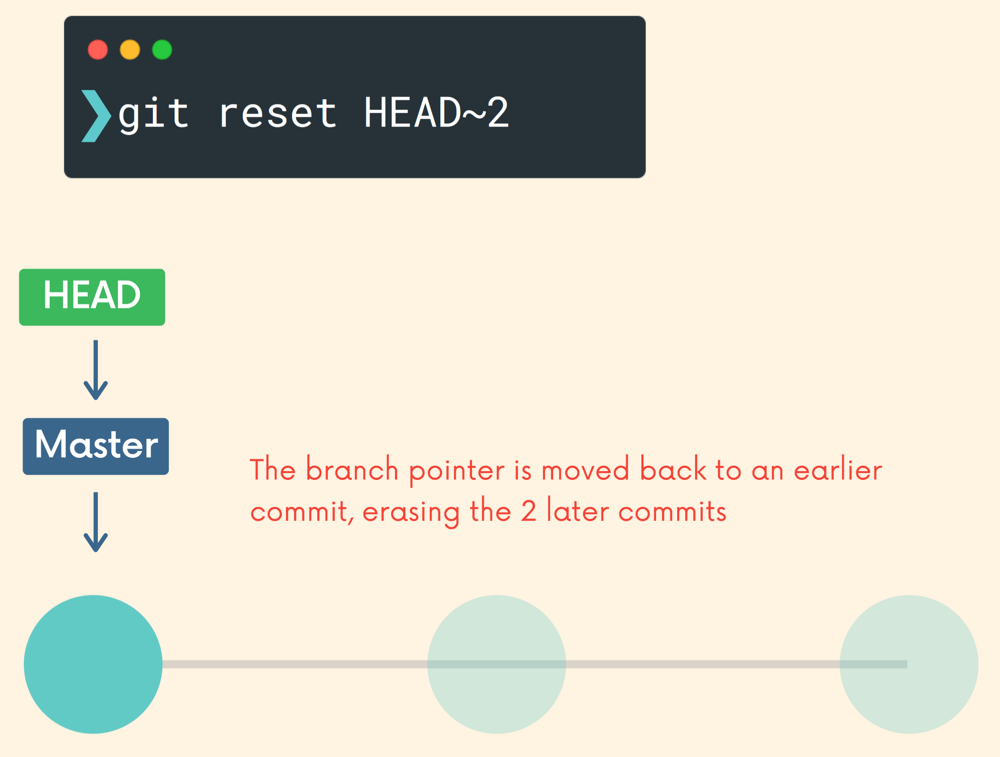
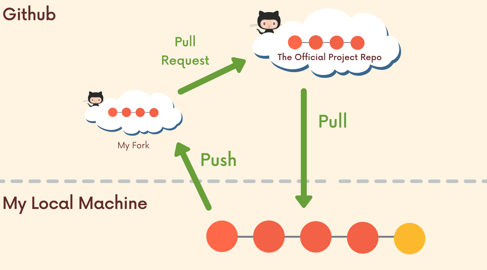
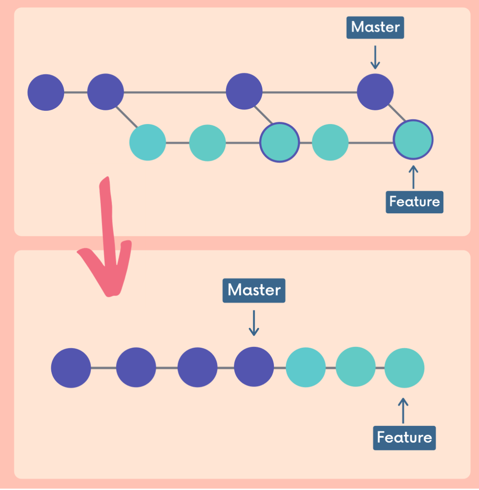

# Brief Description

This is my note for [The Git & Github Bootcamp](https://www.udemy.com/course/git-and-github-bootcamp/) course

# Course Covers

**Git Core :** **`Intro to Git`**, [**`Installation`**](#installation--setup), [**`Command Line`**](#command-line), [**`Git Basics`**](#git-basics), [**`Committing in Detail`**](#committing-in-detail), [**`Branching`**](#branching), [**`Merging`**](#merging)

**Next Level Git :** [**`Diffing`**](#diffing), [**`Stashing`**](#stashing), [**`Undoing Changes`**](#undoing-changes--time-traveling)

**Github and Collaboration Core :** [**`Github Basics`**](#github-basics), [**`Fetching & Pulling`**](#fetching--pulling), [**`Github Odds & Ends`**](#github-odds--ends), [**`Collaborative Workflows`**](#collaborative-workflows)

**The Other Parts :** [**`Rebasing`**](#rebasing), [**`Interactive Rebasing`**](#interactive-rebasing), [**`Git Tags`**](#git-tags), [**`Git Behind The Scenes`**](#git-behind-the-scenes), [**`Reflogs`**](#reflogs), **`Custom Aliases`**

# Installation & Setup

- Configuration

```python
# user's name
git config user.name # get
git config --global user.name "[name]" # set

# email
git config user.email # get
git config --global user.email "[email]" # set

# default branch-name
git config init.defaultBranch # get
git config --global init.defaultBranch main # set
```

# Command Line

- `ls` : list directory content

- `ls -a` : list all directory content including hidden one

- `pwd` : print working directory (return current working directory)

- `cd` : change directory (only `cd` is same as `cd ~`)

- `cd ..` : back to parent directory

- `cd /` : go to terminal directory

- `cd ~` : go to user home

- `cd c/folder` : go to folder in drive c

- `mkdir test` : create folder

- `start folder`(Windows) : open folder in file explorer (`open folder` for other OS)

- `start .` (Windows) : open current working directory in file explorer (`open .` for other OS)

- `echo "" > index.html`(Windows) : create index.html file in current working directory (`touch index.html` for other OS)

- `cat > b.txt` + `enter` + `hello` + `enter` + `crtl+v` : create file with `hello` in content

- `cat b.txt` : look at content

- `cat b.txt >> c.txt` : concatenate b.txt to c.txt

- `subl` : Open sublime text (Windows). follow config below first.

  - add code below in file `C:\Users\Titta\.bash_profile`

  - `alias subl="/c/Program\ Files/Sublime\ Text/sublime_text.exe"`

- `open -a “Sublime Text”` (Other OS) : open sublime text for other OS

- `mv index.html about.html` : change name `index.html` to `about.html`

- `mv style.css /css` : move `style.css` to `/css` subfolder

- `rm <file>` : remove file

- `rm -r <folder>` : remove folder (-r recursive inside folder as well)

- `clear` : clear output

- `cp (-r) <file/folder name> -r <folder>` : copy file/folder use -r for folder (recursive)

- `nano b.txt` : open text editor

# Git Basics

- Repo (Repository) : workspace / folder

- `git status`

- `git init`

- `git add file1 file2`

- `git add .`

- Working Directory

- Staging Area : Something intermediate between working directory abd repo

- Repo (Repository) : workspace / `.git` folder


- `git commit -m "message"`

- `git commit -a -m "message"` or `git commit -am "message"` : `git add <tracked-file>` and `git commit -m "message"`. Note: `<tracked file>` is not include new file.

- `git log`

# Committing in Detail

- Atomic Commit : 1 commit, 1 thing

- Use present tense in Git Commit message (It is only convention in Git Docs)

- Change default text editor for `git commit` without message

```
git config --global core.editor "code --wait"
```

- `git log --oneline`

- `git commit --amend` : change last commit

# Branching

- `git branch` : list all branches

- `git branch <branch-name>` : create new branch

- `git switch <branch-name>` : switch branch

- `git checkout <branch-name>` : switch branch

- `git switch -c <branch-name>` : create and switch branch

- `git checkout -b <branch-name>` : create and switch branch

- **Commit before switch branch**

- `git branch -d <branch-name>` : delete fully merged branch

- `git branch -D <branch-name>` : force delete unmerged branch

- `git branch -m <branch-name>` : rename current branch to `<branch-name>`

# Merging

- Merge `<incoming-branch>` into `<receiving-branch>`. We have to be on the `<receiving-branch>`

```
git switch <receiving-branch>
git merge <incoming-branch>
```

- Fast-Forward Merge : `<receiving-branch>` and `<incoming-branch>` are in the same chain. `<receiving-branch>` is in the past and will be fast forward to `<incoming-branch>`

<p align="center"> </p>

- Non Fast-Forward Merge **without Conflict** : `<receiving-branch>` and `<incoming-branch>` are in the different chains. Git will generate new commit consisting both chains from `<receiving-branch>` and `<incoming-branch>`.

<p align="center"> </p>

- Non Fast-Forward Merge **with Conflict** :
  1. open files with merge conflicts
  2. remove the conflicts and remove conflict marker
  3. `git add .` and `git commit`

# Diffing

- `git diff` : working directory and staging area

- `git diff HEAD` : working directory and HEAD (last commit)

- `HEAD~1` : parent of head

- `git diff --staged` : last commit and staging area

- `git diff <filename1> <filename2>` : narrow down to specific `<filename1>` and `<filename2>`

- `git diff <branch-name1>..<branch-name2>` : `<branch-name1>` and `<branch-name2>` `<old>..<new>`

- `git diff <commit-hash1>..<commit-hash2>` : `<commit-hash1>` and `<commit-hash2>` (`<commit-hash>` is git hash, some pre-fix of git hash)

# Stashing

- save uncommitted changes without unnecessary commits.

- `git stash` : save all uncommitted change (staged and unstaged)

- `git stash pop` : pop oldest stash (FIFO) and re-apply to current working copy

- `git stash apply` : apply without remove

- `git stash list` : show stash queue (FIFO)

- `git stash apply stash@{<id>}`, `git stash apply stash@{2}` : apply specific stash in the queue

- `git stash drop stash@{<id>}`, `git stash drop stash@{2}` : remove specific stash in the queue

- `git stash clear` : clear all stash

# Undoing Changes & Time Traveling

- `git checkout` are old command that can do many thing but it is confusing. There are 2 new command for more specific thing: `git switch` and `git restore`


- `git checkout <commit-hash1>` : go to specific commit (`<commit-hash>` is git hash, some pre-fix of git hash)

- Detached HEAD : Head point to specific commit instead of branch. (Normally HEAD point to branch)

- `git switch <branch-name>`, `git checkout <branch-name>` : re-attaching head

- `git checkout HEAD~1` : reference relative to head, go to parent of head

- `git checkout HEAD~2` : reference relative to head, go to grandparent of head

- `git switch -` : go back to current commit of the branch

- `git checkout HEAD <file>` or `git checkout -- <file>` or `git restore <file>` : discarding changes in that files, reverting back to the head.

- `git restore .` : discarding all changes, reverting back to the head.

- `git restore --source HEAD~1 <file>` : git restore to 2 commit ago

- `git restore --staged <file>` : unstage file (move from staging area t working directory)

- `git reset <commit-hash>` : remove commit (but not remove change in working directory)

- `git reset --hard <commit-hash>` or - `git reset --hard HEAD~1` : remove commit and remove change

<p align="center"> </p>

- `git revert <commit-hash>` : similar to `git reset` but not remove commit. it create new commit with undo change.

<p align="center"> </p>

# Github Basics

- Github : host for git repositories

- `git clone <url>` : download git repository to local machine

- SSH keys : can connect github without identifying username and password

- `git remote -v` : display list of remotes

- `git remote add <name> <url>` : add a new remote

- `git remote rename <old-name> <new-name>` : rename remote

- `git remote remove <name>` : remove remote

- `git push <remote> <branch-name>` : push `<branch-name>` on local to `<branch-name>` on remote

- `git push <remote> <local-branch>:<remote-branch>` : push `<local-branch>` on local to `<remote-branch>` on remote

- `git push -u <remote> <branch-name>` : push and make `git push` = `git push <remote> <branch-name>` for next time usage

# Fetching & Pulling

- `git branch -r` : list all remote branches

- `git branch -vv` : list all local branches and their remote tracking branches

- `git checkout <remote>/<remote-branch>` : go to `<remote-branch>` on remote

- `git switch <remote-branch>` or `git checkout --track <remote>/<remote-branch>` : make branch `<local-branch>` = `<remote>/<remote-branch>` in the same branch name


- `git fetch <remote>` : fetch all changes from the remote repository without merging to local working directory. this will **not create conflict**

<p align="center"> </p>

- `git pull <remote> <branch>` : `git fetch <remote>` + `git merge <branch>`

  - Good practice : `git pull` and fix merge conflict before `git push`
  - can result in **merge conflict**
  - not recommend if you have uncommitted changes!

- `git pull` : this will use default value as `git pull origin <tracking-current-branch>`

<p align="center"> </p>

# Github Odds & Ends

- Github Gists : are a simple way to share code snippets and useful fragments with others. Gists are much easier to create, but offer far fewer features than a typical Github repository.

- Github pages : public webpages that are hosted and published via Github. Github Pages is a hosting service for static webpages, so it does not support server-side code like Python, Ruby, or Node. Just HTML/CSS/JS!

# Collaborative Workflows

## Centralized Workflow

- Everyone Works On Master/Main
- The Most Basic Workflow Possible
- Problem: lots of conflicts, incomplete code in master.

## Feature-Branch Workflow

- Treat master/main branch as the official project history
- all new development should be done on separate branches!
- Multiple teammates can collaborate on a single feature and share code back and forth without polluting the master/main branch
- Master/main branch won't contain broken code (or at least, it won't unless someone messes up)
- **Pull Request** : are a feature built in to products like Github & Bitbucket. They are not native to Git itself

## Fork & Clone Workflow

- Forking : allow us to create personal copies of other peoples' repositories. We call those copies a "fork" of the original.
  - forking is not a Git feature. The ability to fork is implemented by Github.

<p align="center"></p>

1. I fork the original project repo on Github
2. I clone my fork to my local machine
3. I add a remote pointing to the original project repo. This remote is often named upstream.
4. I make changes and add/commit on a feature branch on my local machine
5. I push up my new feature branch to my forked repo (usually called origin)
6. I open a pull request to the original project repo containing the new work on my forked repo.
7. Hopefully the pull request is accepted and my changes are merged in!

# Rebasing

- Rebase :

  - as an alternative to merging
  - as a cleanup tool for git history (interactive rebase)

- move `<side-branch>` to the head of `<main-branch>`
  - all commits in `<side-branch>` are recreate (commit hashes are changed)

```
git switch <side-branch>
git rebase <main-branch>
```

<p align="center"></p>

- Never rebase commit that already shared with others.

- `git rebase --continue` : conflict happen after rebase and fixed the conflict before continue rebase

# Interactive Rebasing

- rewrite, delete, rename, reorder commits using `git rebase` (clean commit history)

- should rebase only working feature branch before sharing.

- should not rebase shared commit!!

- `git rebase -i HEAD~4`

- common commands for rebase
  - pick - use the commit
  - reword - use the commit, but edit the commit message
  - edit - use commit, but stop for amending
  - fixup - (combine) use commit contents but meld it into previous commit and discard the commit message.
  - drop - remove commit

# Git Tags

- pointer to specific commit.
- most often used to mark version releases in projects (v4.1.0, v4.1.1, etc.)
- Think of tags as branch references that do NOT CHANGE. Once a tag is created, it always refers to the same commit. It's just a label for a commit.

- 2 types
  1. lightweight tags : only name/label
  2. annotated tags : store extra meta data including the author's name and email, the date, and a tagging message (like a commit message)

## Semantic Versioning

- Major.Minor.Patch (e.g., 2.4.1)

- Initial Release (1.0.0)

- Patch Release (1.0.1) :

  - Patch releases normally do not contain new features or significant changes. - They typically signify bug fixes and other changes that do not impact how the code is used

- Minor Release (1.1.0) :

  - Minor releases signify that new features or functionality have been added, but the project is still **backwards compatible**. No breaking changes.
  - The new functionality is optional and should not force users to rewrite their own code.

- Major Release (2.0.0) :

  - Major releases signify significant changes that is no longer backwards compatible.
  - Features may be removed or changed substantially.

- Document : [semver.org](https://semver.org/)

## Git Tags Commands

- `git tag` : list all tags

- `git tag -l "*beta*"` : search tags

- `git checkout <tag>` e.g. `git checkout v17.0.0` : go to `<tag>`

- `git diff v17.0.0 v17.0.1`

- `git tag <tagname>` (lightweight tag) : tag HEAD

- `git tag -a <tagname>` (annotated tag) : tag HEAD

- `git show <tagname>` : show tag information

- `git tag <tagname> <commit>` : tagging previous commits

- `git tag -f <tagname>` or `git tag -f <tagname> <commit>` : force tag

  - tag name must be unique. in case, it is not unique, git will return error that tag exists. and `-f` will force that tag to move to the commit

- `git tag -d <tagname>` : delete tag

- `git push --tags` : push tags

  - normally `git push` not push tags.

- `git push <remote> <tag>` : push specific tags to remote

# Git Behind The Scenes

- `git config --local` : local config file

- Git Object

  - blob : binary large object (content in file)
  - tree : folder
  - commit
  - annotated tag

- nothing much important here!

- please see original slides [here](./asset/git_behind_the_scenes.pdf)

# Reflogs
